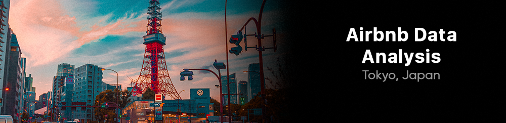

# airbnb_data

  

This data science project aims to explore and analyze actual Airbnb data in Tokyo, Japan based on datasets provided by the Inside Airbnb portal. Tokyo, the capital of Japan, is a dynamic city filled with culture, history and a unique tourist experience.

Tokyo is one of the most visited cities in the world, attracting millions of tourists. With its rich culture, modern architecture, delicious food, vibrant festivals and a plethora of tourist attractions, the city offers an exciting experience for visitors.

Some of the most popular sights in Tokyo include:

- Senso-ji Temple: Located in the Asakusa district, it is one of the oldest and most revered temples in Tokyo.
- Tokyo Tower: An iconic structure offering panoramic views of the city.
- Imperial Palace: Official residence of the Emperor of Japan, located in a vast park in the heart of the city.
- Shibuya District: Known for its busy intersection, trendy shops, restaurants and lively nightlife.
- Shinjuku District: Filled with skyscrapers, the district is known for its hustle, nightlife and the famous Shinjuku Gyoen National Park.
- Ginza: A luxury shopping district, with a multitude of international brand stores and Japanese designer boutiques.
- Tsukiji Market: One of the largest fish markets in the world, offering a variety of fresh seafood and delicious sushi.

EThese are just a few examples of the many tourist attractions Tokyo has to offer.

By analyzing Airbnb data, we can gain valuable insights into the most popular neighborhoods and available accommodation in the city.

 Tokyo is a vast city, made up of diverse neighborhoods, each with its own unique atmosphere and characteristics. Some of the most famous and popular neighborhoods include:

- Shinjuku: One of Tokyo's main business districts, filled with skyscrapers, shops, restaurants, parks and vibrant nightlife.
- Shibuya: Known as a center of fashion and youth culture, it is famous for its busy intersection, large department stores, cafes and lively nightlife.
- Asakusa: A historic area of Tokyo, with Senso-ji Temple as its main attraction, offering a traditional atmosphere and many souvenir shops.
- Ginza: Tokyo's most luxurious neighborhood, known for its department stores, designer boutiques, high-end restaurants and theaters.
- Roppongi: A trendy district with a bustling nightlife, art galleries, international restaurants and the Tokyo Tower observatory.
- Akihabara: Known as the paradise of electronics, it is the center of otaku subcultures and video game culture.

 Each offers a unique experience for visitors, from vibrant nightlife to immersing themselves in traditional Japanese culture.
 
 For this project, we used data provided by the Inside Airbnb portal, which offers detailed datasets on Airbnb listings and hosts in Tokyo. This data includes valuable information such as property features, availability, location and price.
 
 By exploring this data, we can answer several interesting questions, such as:

 - What are the most common types of properties available for rent?
 - How do accommodation prices vary in different Tokyo neighborhoods?
 - Is there any correlation between price and other property features?
 - What is the geographic distribution of Airbnb properties in Tokyo?

Analyzing these questions will allow us to gain valuable insights into the Tokyo Airbnb market and help both travelers and hosts make informed decisions.

In this project, we will use data science and Python programming techniques to explore, visualize and analyze this data in order to gain a deeper understanding of the market.

I hope this project provides useful information for anyone interested in visiting or staying in Tokyo, as well as data science and data analysis enthusiasts.
